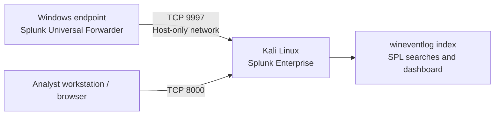

# Splunk SOC Home Lab

A practical, GitHub-ready Security Operations Center (SOC) home lab for collecting Windows security events in Splunk Enterprise, investigating authentication activity, and documenting detection engineering work. The lab is designed for a small VirtualBox environment with Kali Linux running Splunk and a Windows 10/11 endpoint running Splunk Universal Forwarder.

> **Lab scope:** Use only virtual machines and accounts you own. Keep the host-only network isolated. This is a learning lab, not a production deployment or a claim of real-world incident response experience.

## What this project demonstrates

- SIEM installation and Windows event ingestion
- Log source validation and basic field normalization
- SPL detections for failed logons, password spraying, suspicious success after failures, privileged logons, account lockouts, and cleared audit logs
- Alert triage, evidence capture, and incident documentation
- Security-minded lab network design and safe testing

## Architecture



Recommended VirtualBox networking: give both VMs **Adapter 1: NAT** for updates and **Adapter 2: Host-only Adapter** for lab traffic. The host-only adapter lets the Windows VM reach Kali without exposing the receiver to your wider network. Record the host-only IP addresses from `ipconfig` on Windows and `ip addr` on Kali. Configure the Windows forwarder to send to the **Kali host-only IP**, not Windows' own IP (for example, not `10.0.2.15` if that is shown by Windows `ipconfig`).

## Repository map

```text
.
├── README.md
├── LICENSE
├── .gitignore
├── docs/
│   ├── architecture-and-scope.md
│   ├── deployment-guide.md
│   ├── validation-and-testing.md
│   ├── investigation-workflow.md
│   └── incident-report-template.md
├── configs/
│   ├── kali-receiver-inputs.conf.example
│   ├── windows-uf-inputs.conf
│   └── windows-uf-outputs.conf.example
├── detections/
│   ├── 01_failed_logon_burst.spl
│   ├── 02_password_spray.spl
│   ├── 03_failure_then_success.spl
│   ├── 04_privileged_logon.spl
│   ├── 05_account_lockout.spl
│   └── 06_security_log_cleared.spl
├── dashboards/
│   └── windows_auth_overview.xml
└── references/
    └── sources.md
```

## Quick start

1. Create the isolated VirtualBox network using [the deployment guide](docs/deployment-guide.md).
2. Start Splunk Enterprise on Kali and enable a receiving port on TCP `9997`.
3. Install Splunk Universal Forwarder on Windows and apply the sample input/output configuration in `configs/`.
4. Confirm events arrive using the validation searches in the deployment guide.
5. Run the safe validation steps in [the testing guide](docs/validation-and-testing.md).
6. Run the SPL detections in `detections/`, tune thresholds for your lab, and document one investigation with the provided template.

## Data model and assumptions

The examples use `index=wineventlog` and Windows Security event IDs. If your events use another index, replace the index name. Splunk's Windows event parsing and installed add-ons affect field names. Start with the raw event and field discovery searches in `docs/deployment-guide.md`; adjust aliases in the detections if your environment uses different names. The detection SPLs handle common variants for username and source IP fields, but no single field mapping is guaranteed for every installation.

## Detection catalog

| ID | Detection | Starting threshold | Event IDs |
|---|---|---:|---|
| DET-001 | Failed logon burst | 5 failures in 10 minutes | 4625 |
| DET-002 | Password spray pattern | 10 failures across 5+ users in 10 minutes | 4625 |
| DET-003 | Failure followed by successful logon | Failure and success in same 10-minute bucket | 4624, 4625 |
| DET-004 | Special privileges assigned at logon | Any matching event for review | 4672 |
| DET-005 | Account lockout | Any matching event for review | 4740 |
| DET-006 | Security audit log cleared | Any matching event; high priority | 1102 |

Thresholds are starter values for a quiet home lab. They are not universal production thresholds. Add exclusions only when you can explain and document them.

## Evidence to add before publishing

Add your own redacted screenshots under `docs/images/` (for example, a VirtualBox network view, Splunk receiver status, a successful event search, and one detection result). Do not commit passwords, tokens, public IPs, personal data, VM snapshots, or unredacted security events. See `.gitignore` and the evidence checklist in the deployment guide.

## Troubleshooting in brief

- **No events:** Confirm Windows forwarder service is running, Kali is listening on TCP 9997, and Windows can reach Kali's host-only address.
- **Connection test points to `10.0.2.15`:** That is the Windows address in the earlier NAT example. Check the destination; it must be the Kali receiving IP.
- **TCP 9997 fails:** Enable receiving in Splunk and allow the port on Kali's firewall for the host-only subnet.
- **Events arrive in another index:** Use the actual index in searches or set `index=wineventlog` in the Windows input stanzas.
- **No 4625 events:** Check Windows audit policy for Logon failures, then generate one controlled failed sign-in in the isolated VM. Avoid repeated attempts against real accounts.

## License and attribution

This educational repository is released under the MIT License. See [LICENSE](LICENSE). Consult [references/sources.md](references/sources.md) for product documentation used to shape the configuration examples.
